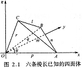
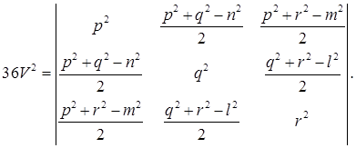
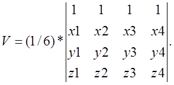

# 计算几何

## 几何公式

### 三角形:
1. 半周长 P=(a+b+c)/2
2. 面积 S=aHa/2=absin(C)/2=sqrt(P(P-a)(P-b)(P-c))
3. 中线 Ma=sqrt(2(b^2+c^2)-a^2)/2=sqrt(b^2+c^2+2bccos(A))/2
4. 角平分线 Ta=sqrt(bc((b+c)^2-a^2))/(b+c)=2bccos(A/2)/(b+c)
5. 高线 Ha=bsin(C)=csin(B)=sqrt(b^2-((a^2+b^2-c^2)/(2a))^2)
6. 内切圆半径 r=S/P=asin(B/2)sin(C/2)/sin((B+C)/2)
               =4Rsin(A/2)sin(B/2)sin(C/2)=sqrt((P-a)(P-b)(P-c)/P)
               =Ptan(A/2)tan(B/2)tan(C/2)
7. 外接圆半径 R=abc/(4S)=a/(2sin(A))=b/(2sin(B))=c/(2sin(C))

### 四边形:
D1,D2为对角线,M对角线中点连线,A为对角线夹角
1. a^2+b^2+c^2+d^2=D1^2+D2^2+4M^2
2. S=D1D2sin(A)/2
(以下对圆的内接四边形)
3. ac+bd=D1D2
4. S=sqrt((P-a)(P-b)(P-c)(P-d)),P为半周长

### 正n边形:
R为外接圆半径,r为内切圆半径
1. 中心角 A=2PI/n
2. 内角 C=(n-2)PI/n
3. 边长 a=2sqrt(R^2-r^2)=2Rsin(A/2)=2rtan(A/2)
4. 面积 S=nar/2=nr^2tan(A/2)=nR^2sin(A)/2=na^2/(4tan(A/2))

### 圆:
1. 弧长 l=rA
2. 弦长 a=2sqrt(2hr-h^2)=2rsin(A/2)
3. 弓形高 h=r-sqrt(r^2-a^2/4)=r(1-cos(A/2))=atan(A/4)/2
4. 扇形面积 S1=rl/2=r^2A/2
5. 弓形面积 S2=(rl-a(r-h))/2=r^2(A-sin(A))/2

### 棱柱:
1. 体积 V=Ah,A为底面积,h为高
2. 侧面积 S=lp,l为棱长,p为直截面周长
3. 全面积 T=S+2A

### 棱锥:
1. 体积 V=Ah/3,A为底面积,h为高
(以下对正棱锥)
2. 侧面积 S=lp/2,l为斜高,p为底面周长
3. 全面积 T=S+A

### 棱台:
1. 体积 V=(A1+A2+sqrt(A1A2))h/3,A1.A2为上下底面积,h为高
(以下为正棱台)
2. 侧面积 S=(p1+p2)l/2,p1.p2为上下底面周长,l为斜高
3. 全面积 T=S+A1+A2

### 圆柱:
1. 侧面积 S=2PIrh
2. 全面积 T=2PIr(h+r)
3. 体积 V=PIr^2h

### 圆锥:
1. 母线 l=sqrt(h^2+r^2)
2. 侧面积 S=PIrl
3. 全面积 T=PIr(l+r)
4. 体积 V=PIr^2h/3

### 圆台:
1. 母线 l=sqrt(h^2+(r1-r2)^2)
2. 侧面积 S=PI(r1+r2)l
3. 全面积 T=PIr1(l+r1)+PIr2(l+r2)
4. 体积 V=PI(r1^2+r2^2+r1r2)h/3

### 球:
1. 全面积 T=4PIr^2
2. 体积 V=4PIr^3/3

### 球台:
1. 侧面积 S=2PIrh
2. 全面积 T=PI(2rh+r1^2+r2^2)
3. 体积 V=PIh(3(r1^2+r2^2)+h^2)/6

### 球扇形:
1. 全面积 T=PIr(2h+r0),h为球冠高,r0为球冠底面半径
2. 体积 V=2PIr^2h/3
Euler的任意四面体体积公式（已知边长求体积）


已知4点坐标求体积（其中四个点的坐标分别为（x1,y1,z1）,（x2,y2,z2）,（x3,y3,z3）,（x4,y4,z4））


## 几何模板
```c++
#include<vector>
#include<list>
#include<map>
#include<set>
#include<deque>
#include<queue>
#include<stack>
#include<bitset>
#include<algorithm>
#include<functional>
#include<numeric>
#include<utility>
#include<iostream>
#include<sstream>
#include<iomanip>
#include<cstdio>
#include<cmath>
#include<cstdlib>
#include<cctype>
#include<string>
#include<cstring>
#include<cstdio>
#include<cmath>
#include<cstdlib>
#include<ctime>
#include<climits>
#include<complex>

using namespace std;

#define mp make_pair
#define pb push_back
using namespace std;
const double eps = 1e-8;
const double pi = acos(-1.0);
const double inf = 1e20;
const int maxp = 1111;

//判断符号
//1 大于0
//0 等于0
//-1 小于0
int sgn(double d)
{
    return (d > eps) - (d < -eps);
}

inline double sqr(double x)
{
    return x * x;
}

//点
struct point {
    double x, y;

    point() { }

    point(double _x, double _y) :
        x(_x), y(_y) { };

    void input()
    {
        scanf("%lf%lf", &x, &y);
    }

    void output()
    {
        printf("%.2f %.2f\n", x, y);
    }

    bool operator==(point a) const //判断是否相等
    {
        return sgn(a.x - x) == 0 && sgn(a.y - y) == 0;
    }

    bool operator!=(point a) const //判断是否不等
    {
        return sgn(a.x - x) != 0 || sgn(a.y - y) != 0;
    }

    bool operator<(point a) const
    {
        return sgn(a.x - x) == 0 ? sgn(y - a.y) < 0 : x < a.x;
    }

    point operator+(const point &a) const //两点相加
    {
        return point(x + a.x, y + a.y);
    }

    point operator-(const point &a) const //两点相减，a到点的向量
    {
        return point(x - a.x, y - a.y);
    }

    double operator^(const point &a) const //外积
    {
        return x * a.y - y * a.x;
    }

    double operator*(const point &a) const //内积
    {
        return x * a.x + y * a.y;
    }

    point operator*(const double &a) const //按比例放大
    {
        return point(x * a, y * a);
    }

    point operator/(const double &a) const //按比例缩小
    {
        return point(x / a, y / a);
    }

    double len() //到原点距离
    {
        return hypot(x, y);
    }

    double len2() //到原点距离的平方
    {
        return x * x + y * y;
    }

    double distance(point p) //到指定点距离
    {
        return hypot(x - p.x, y - p.y);
    }

    double rad(point a, point b) //角apb的弧度
    {
        point p = *this;
        return fabs(atan2(fabs((a-p)^(b-p)),(a-p)*(b-p)));
    }

    point trunc(double r) //单位向量
    {
        double l = len();
        if (!sgn(l))return *this;
        r /= l;
        return point(x * r, y * r);
    }

    point rotleft() //逆时针旋转90度
    {
        return point(-y, x);
    }

    point rotright() //顺时针旋转90度
    {
        return point(y, -x);
    }

    point rotate(point p, double angle)//绕点p逆时针旋转angle角度
    {
        point v = *this-p;
        double c = cos(angle), s = sin(angle);
        return point(p.x + v.x * c - v.y * s, p.y + v.x * s + v.y * c);
    }
};

//直线
struct line {
    point a, b;

    line() { }

    line(point _a, point _b)
    {
        a = _a;
        b = _b;
    }

    bool operator==(line v)
    {
        return (a == v.a) && (b == v.b);
    }

    //倾斜角angle
    line(point p, double angle)
    {
        a = p;
        if (sgn(angle - pi / 2) == 0) {
            b = a+point(0, 1);
        } else {
            b = a+point(1, tan(angle));
        }
    }

    //ax+by+c=0
    line(double _a, double _b, double _c)
    {
        if (sgn(_a) == 0) {
            a = point(0, -_c / _b);
            b = point(1, -_c / _b);
        } else if (sgn(_b) == 0) {
            a = point(-_c / _a, 0);
            b = point(-_c / _a, 1);
        } else {
            a = point(0, -_c / _b);
            b = point(1, (-_c - _a) / _b);
        }
    }

    void input()
    {
        a.input();
        b.input();
    }

    void adjust()
    {
        if (b < a)swap(a, b);
    }

    double length()
    {
        return a.distance(b);
    }

    double angle()//直线倾斜角 0<=angle<180
    {
        double k = atan2(b.y - a.y, b.x - a.x);
        if (sgn(k) < 0)k += pi;
        if (sgn(k - pi) == 0)k -= pi;
        return k;
    }

    //点和线段关系
    //1 在逆时针
    //2 在顺时针
    //3 平行
    int relation(point p)
    {
        int c = sgn((p-a)^(b-a));
        if (c < 0)return 1;
        if (c > 0)return 2;
        return 3;
    }

    bool pointonseg(point p)  //判断点在线段上
    {
        return sgn((p-a)^(b-a)) == 0 && sgn((p-a)*(p-b)) <= 0;
    }

    bool pointonray(point p) //判断点在射线上
    {
        return sgn((p-a)^(b-a)) == 0 && sgn((b-a)*(p-a)) >= 0;
    }

    bool parallel(line v)  //判断直线是否平行
    {
        return sgn((b-a)^(v.b-v.a)) == 0;
    }

    //2 规范相交
    //1 非规范相交
    //0 不相交
    int segcrossseg(line v)
    {
        int d1 = sgn((b-a)^(v.a-a));
        int d2 = sgn((b-a)^(v.b-a));
        int d3 = sgn((v.b-v.a)^(a-v.a));
        int d4 = sgn((v.b-v.a)^(b-v.a));
        if ((d1 ^ d2) == -2 && (d3 ^ d4) == -2)return 2;
        return (d1 == 0 && sgn((v.a-a)*(v.a-b)) <= 0 ||
                d2 == 0 && sgn((v.b-a)*(v.b-b)) <= 0 ||
                d3 == 0 && sgn((a-v.a)*(a-v.b)) <= 0 ||
                d4 == 0 && sgn((b-v.a)*(b-v.b)) <= 0);
    }

    int linecrossseg(line v)//*this seg v line
    {
        int d1 = sgn((b-a)^(v.a-a));
        int d2 = sgn((b-a)^(v.b-a));
        if ((d1 ^ d2) == -2)return 2;
        return (d1 == 0 || d2 == 0);
    }

    //0 平行
    //1 重合
    //2 相交
    int linecrossline(line v)
    {
        if ((*this).parallel(v)) {
            return v.relation(a) == 3;
        }
        return 2;
    }

    point crosspoint(line v)
    {
        double a1 = (v.b-v.a)^(a-v.a);
        double a2 = (v.b-v.a)^(b-v.a);
        return point((a.x * a2 - b.x * a1) / (a2 - a1), (a.y * a2 - b.y * a1) / (a2 - a1));
    }

    double dispointtoline(point p)
    {
        return fabs((p-a)^(b-a)) / length();
    }

    double dispointtoseg(point p)
    {
        if (sgn((p-b)*(a-b)) < 0 || sgn((p-a)*(b-a)) < 0) {
            return min(p.distance(a), p.distance(b));
        }
        return dispointtoline(p);
    }

    point lineprog(point p)
    {
        return a+((b-a)*((b-a)*(p-a)) / (b-a).len2());
    }

    point symmetrypoint(point p)
    {
        point q = lineprog(p);
        return point(2 * q.x - p.x, 2 * q.y - p.y);
    }
};

//圆
struct circle {
    point p;
    double r;

    circle() { }

    circle(point _p, double _r) :
        p(_p), r(_r) { };

    circle(double x, double y, double _r) :
        p(point(x, y)), r(_r) { };

    circle(point a, point b, point c)//三角形的外接圆
    {
        p = line((a+b)/2, (a+b)/2+((b-a).rotleft())).crosspoint(
                line((c+b)/2, (c+b)/2+(b-c).rotleft()));
        r = p.distance(a);
    }

    circle(point a, point b, point c, bool t)//三角形的内切圆
    {
        line u, v;
        double m = atan2(b.y - a.y, b.x - a.x), n = atan2(c.y - a.y, c.x - a.x);
        u.a = a;
        u.b = u.a + (point(cos((n + m) / 2), sin((n + m) / 2)));
        v.a = b;
        m = atan2(a.y - b.y, a.x - b.x), n = atan2(c.y - b.y, c.x - b.x);
        v.b = v.a+(point(cos((n + m) / 2), sin((n + m) / 2)));
        p = u.crosspoint(v);
        r = line(a, b).dispointtoseg(p);
    }

    void input()
    {
        p.input();
        scanf("%lf", &r);
    }

    void output()
    {
        printf("%.2lf %.2lf %.2lf\n", p.x, p.y, r);
    }

    bool operator==(circle v)
    {
        return ((p == v.p) && sgn(r - v.r) == 0);
    }

    bool operator<(circle v) const
    {
        return ((p < v.p) || (p == v.p) && sgn(r - v.r) < 0);
    }

    double area()
    {
        return pi * sqr(r);
    }

    double circumference()
    {
        return 2 * pi * r;
    }

    //0 圆外
    //1 圆上
    //2 圆内
    int relation(point b)
    {
        double dst = b.distance(p);
        if (sgn(dst - r) < 0)return 2;
        if (sgn(dst - r) == 0)return 1;
        return 0;
    }

    int relationseg(line v)
    {
        double dst = v.dispointtoseg(p);
        if (sgn(dst - r) < 0)return 2;
        if (sgn(dst - r) == 0)return 1;
        return 0;
    }

    int relationline(line v)
    {
        double dst = v.dispointtoline(p);
        if (sgn(dst - r) < 0)return 2;
        if (sgn(dst - r) == 0)return 1;
        return 0;
    }

    //过a b两点 半径r的两个圆
    int getcircle(point a, point b, double r, circle &c1, circle &c2)
    {
        circle x(a, r), y(b, r);
        int t = x.pointcrosscircle(y, c1.p, c2.p);
        if (!t)return 0;
        c1.r = c2.r = r;
        return t;
    }

    //与直线u相切 过点q 半径r1的圆
    int getcircle(line u, point q, double r1, circle &c1, circle &c2)
    {
        double dis = u.dispointtoline(q);
        if (sgn(dis - r1 * 2) > 0)return 0;
        if (sgn(dis) == 0) {
            c1.p = (q+u.b-u.a).rotleft().trunc(r1);
            c2.p = (q+u.b-u.a).rotright().trunc(r1);
            c1.r = c2.r = r1;
            return 2;
        }
        line u1 = line(u.a+(u.b-u.a).rotleft().trunc(r1), u.b+(u.b-u.a).rotleft().trunc(r1));
        line u2 = line(u.a+(u.b-u.a).rotright().trunc(r1), u.b+(u.b-u.a).rotright().trunc(r1));
        circle cc = circle(q, r1);
        point p1, p2;
        if (!cc.pointcrossline(u1, p1, p2))cc.pointcrossline(u2, p1, p2);
        c1 = circle(p1, r1);
        if (p1 == p2) {
            c2 = c1;
            return 1;
        }
        c2 = circle(p2, r1);
        return 2;
    }

    //同时与直线u,v相切 半径r1的圆
    int getcircle(line u, line v, double r1, circle &c1, circle &c2, circle &c3, circle &c4)
    {
        if (u.parallel(v))return 0;
        line u1 = line(u.a+(u.b-u.a).rotleft().trunc(r1), u.b+(u.b-u.a).rotleft().trunc(r1));
        line u2 = line(u.a+(u.b-u.a).rotright().trunc(r1), u.b+(u.b-u.a).rotright().trunc(r1));
        line v1 = line(v.a+(v.b-v.a).rotleft().trunc(r1), v.b+(v.b-v.a).rotleft().trunc(r1));
        line v2 = line(v.a+(v.b-v.a).rotright().trunc(r1), v.b+(v.b-v.a).rotright().trunc(r1));
        c1.r = c2.r = c3.r = c4.r = r1;
        c1.p = u1.crosspoint(v1);
        c2.p = u1.crosspoint(v2);
        c3.p = u2.crosspoint(v1);
        c4.p = u2.crosspoint(v2);
        return 4;
    }

    //同时与不相交圆cx,cy相切 半径为r1的圆
    int getcircle(circle cx, circle cy, double r1, circle &c1, circle &c2)
    {
        circle x(cx.p, r1 + cx.r), y(cy.p, r1 + cy.r);
        int t = x.pointcrosscircle(y, c1.p, c2.p);
        if (!t)return 0;
        c1.r = c2.r = r1;
        return t;
    }

    int pointcrossline(line v, point &p1, point &p2)//求与线段交要先判断relationseg
    {
        if (!(*this).relationline(v))return 0;
        point a = v.lineprog(p);
        double d = v.dispointtoline(p);
        d = sqrt(r * r - d * d);
        if (sgn(d) == 0) {
            p1 = a;
            p2 = a;
            return 1;
        }
        p1 = a+(v.b-v.a).trunc(d);
        p2 = a+(v.b-v.a).trunc(d);
        return 2;
    }

    //5 相离
    //4 外切
    //3 相交
    //2 内切
    //1 内含
    int relationcircle(circle v)
    {
        double d = p.distance(v.p);
        if (sgn(d - r - v.r) > 0)return 5;
        if (sgn(d - r - v.r) == 0)return 4;
        double l = fabs(r - v.r);
        if (sgn(d - r - v.r) < 0 && sgn(d - l) > 0)return 3;
        if (sgn(d - l) == 0)return 2;
        if (sgn(d - l) < 0)return 1;
    }

    int pointcrosscircle(circle v, point &p1, point &p2)
    {
        int rel = relationcircle(v);
        if (rel == 1 || rel == 5)return 0;
        double d = p.distance(v.p);
        double l = (d + (sqr(r) - sqr(v.r)) / d) / 2;
        double h = sqrt(sqr(r) - sqr(l));
        p1 = p+(v.p-p).trunc(l)+(v.p-p).rotleft().trunc(h);
        p2 = p+(v.p-p).trunc(l)+(v.p-p).rotright().trunc(h);
        if (rel == 2 || rel == 4) {
            return 1;
        }
        return 2;
    }

    //过一点做圆的切线 (先判断点和圆关系)
    int tangentline(point q, line &u, line &v)
    {
        int x = relation(q);
        if (x == 2)return 0;
        if (x == 1) {
            u = line(q, q+(q-p).rotleft());
            v = u;
            return 1;
        }
        double d = p.distance(q);
        double l = sqr(r) / d;
        double h = sqrt(sqr(r) - sqr(l));
        u = line(q, p+(q-p).trunc(l)+(q-p).rotleft().trunc(h));
        v = line(q, p+(q-p).trunc(l)+(q-p).rotright().trunc(h));
        return 2;
    }

    double areacircle(circle v)
    {
        int rel = relationcircle(v);
        if (rel >= 4)return 0.0;
        if (rel <= 2)return min(area(), v.area());
        double d = p.distance(v.p);
        double hf = (r + v.r + d) / 2.0;
        double ss = 2 * sqrt(hf * (hf - r) * (hf - v.r) * (hf - d));
        double a1 = acos((r * r + d * d - v.r * v.r) / (2.0 * r * d));
        a1 = a1 * r * r;
        double a2 = acos((v.r * v.r + d * d - r * r) / (2.0 * v.r * d));
        a2 = a2 * v.r * v.r;
        return a1 + a2 - ss;
    }

    double areatriangle(point a, point b)
    {
        if (sgn((p-a)^(p-b)) == 0)return 0.0;
        point q[5];
        int len = 0;
        q[len++] = a;
        line l(a, b);
        point p1, p2;
        if (pointcrossline(l, q[1], q[2]) == 2) {
            if (sgn((a-q[1])*(b-q[1])) < 0)q[len++] = q[1];
            if (sgn((a-q[2])*(b-q[2])) < 0)q[len++] = q[2];
        }
        q[len++] = b;
        if (len == 4 && (sgn((q[0]-q[1])*(q[2]-q[1])) > 0))swap(q[1], q[2]);
        double res = 0;
        int i;
        for (i = 0; i < len - 1; i++) {
            if (relation(q[i]) == 0 || relation(q[i + 1]) == 0) {
                double arg = p.rad(q[i], q[i + 1]);
                res += r * r * arg / 2.0;
            } else {
                res += fabs((q[i]-p)^(q[i + 1]-p)) / 2.0;
            }
        }
        return res;
    }
};

//多边形
struct polygon {
    int n;
    point p[maxp];
    line l[maxp];

    void input()
    {
        n = 4;
        for (int i = 0; i < n; i++) {
            p[i].input();
        }
    }

    void add(point q)
    {
        p[n++] = q;
    }

    void getline()
    {
        for (int i = 0; i < n; i++) {
            l[i] = line(p[i], p[(i + 1) % n]);
        }
    }

    struct cmp {
        point p;

        cmp(const point &p0)
        {
            p = p0;
        }

        bool operator()(const point &aa, const point &bb)
        {
            point a = aa, b = bb;
            int d = sgn((a-p)^(b-p));
            if (d == 0) {
                return sgn(a.distance(p) - b.distance(p)) < 0;
            }
            return d > 0;
        }
    };

    void norm()
    {
        point mi = p[0];
        for (int i = 1; i < n; i++)mi = min(mi, p[i]);
        sort(p, p + n, cmp(mi));
    }

    void getconvex(polygon &convex)
    {
        int i, j, k;
        sort(p, p + n);
        convex.n = n;
        for (i = 0; i < min(n, 2); i++) {
            convex.p[i] = p[i];
        }
        if (n <= 2)return;
        int &top = convex.n;
        top = 1;
        for (i = 2; i < n; i++) {
            while (top && ((convex.p[top]-p[i])^(convex.p[top - 1]-p[i])) <= 0) //去掉=，就是包含凸包线上的点
                top--;
            convex.p[++top] = p[i];
        }
        int temp = top;
        convex.p[++top] = p[n - 2];
        for (i = n - 3; i >= 0; i--) {
            while (top != temp && ((convex.p[top]-p[i])^(convex.p[top - 1]-p[i])) <= 0) //去掉=，就是包含凸包线上的点
                top--;
            convex.p[++top] = p[i];
        }
    }

    bool isconvex()
    {
        bool s[3];
        memset(s, 0, sizeof(s));
        int i, j, k;
        for (i = 0; i < n; i++) {
            j = (i + 1) % n;
            k = (j + 1) % n;
            s[sgn((p[j]-p[i])^(p[k]-p[i])) + 1] = 1;
            if (s[0] && s[2])return 0;
        }
        return 1;
    }

    //3 点上
    //2 边上
    //1 内部
    //0 外部
    int relationpoint(point q)
    {
        int i, j;
        for (i = 0; i < n; i++) {
            if (p[i] == q)return 3;
        }
        getline();
        for (i = 0; i < n; i++) {
            if (l[i].pointonseg(q))return 2;
        }
        int cnt = 0;
        for (i = 0; i < n; i++) {
            j = (i + 1) % n;
            int k = sgn((q-p[j])^(p[i]-p[j]));
            int u = sgn(p[i].y - q.y);
            int v = sgn(p[j].y - q.y);
            if (k > 0 && u < 0 && v >= 0)cnt++;
            if (k < 0 && v < 0 && u >= 0)cnt--;
        }
        return cnt != 0;
    }

    //1 在多边形内长度为正
    //2 相交或与边平行
    //0 无任何交点
    int relationline(line u)
    {
        int i, j, k = 0;
        getline();
        for (i = 0; i < n; i++) {
            if (l[i].segcrossseg(u) == 2)return 1;
            if (l[i].segcrossseg(u) == 1)k = 1;
        }
        if (!k)return 0;
        vector<point> vp;
        for (i = 0; i < n; i++) {
            if (l[i].segcrossseg(u)) {
                if (l[i].parallel(u)) {
                    vp.pb(u.a);
                    vp.pb(u.b);
                    vp.pb(l[i].a);
                    vp.pb(l[i].b);
                    continue;
                }
                vp.pb(l[i].crosspoint(u));
            }
        }
        sort(vp.begin(), vp.end());
        int sz = vp.size();
        for (i = 0; i < sz - 1; i++) {
            point mid = (vp[i]+vp[i + 1])/2;
            if (relationpoint(mid) == 1)return 1;
        }
        return 2;
    }

    //直线u切割凸多边形左侧
    //注意直线方向
    void convexcut(line u, polygon &po)
    {
        int i, j, k;
        int &top = po.n;
        top = 0;
        for (i = 0; i < n; i++) {
            int d1 = sgn((p[i]-u.a)^(u.b-u.a));
            int d2 = sgn((p[(i + 1) % n]-u.a)^(u.b-u.a));
            if (d1 >= 0)po.p[top++] = p[i];
            if (d1 * d2 < 0)po.p[top++] = u.crosspoint(line(p[i], p[(i + 1) % n]));
        }
    }

    double getcircumference()
    {
        double sum = 0;
        int i;
        for (i = 0; i < n; i++) {
            sum += p[i].distance(p[(i + 1) % n]);
        }
        return sum;
    }

    double getarea()
    {
        double sum = 0;
        int i;
        for (i = 0; i < n; i++) {
            sum += p[i]^(p[(i + 1) % n]);
        }
        return fabs(sum) / 2;
    }

    bool getdir()//1代表逆时针 0代表顺时针
    {
        double sum = 0;
        int i;
        for (i = 0; i < n; i++) {
            sum += p[i]^(p[(i + 1) % n]);
        }
        if (sgn(sum) > 0)return 1;
        return 0;
    }

    point getbarycentre()
    {
        point ret(0, 0);
        double area = 0;
        int i;
        for (i = 1; i < n - 1; i++) {
            double tmp = (p[i]-p[0])^(p[i + 1]-p[0]);
            if (sgn(tmp) == 0)continue;
            area += tmp;
            ret.x += (p[0].x + p[i].x + p[i + 1].x) / 3 * tmp;
            ret.y += (p[0].y + p[i].y + p[i + 1].y) / 3 * tmp;
        }
        if (sgn(area))ret = ret/area;
        return ret;
    }

    double areaintersection(polygon po)
    {
    }

    double areaunion(polygon po)
    {
        return getarea() + po.getarea() - areaintersection(po);
    }

    double areacircle(circle c)
    {
        int i, j, k, l, m;
        double ans = 0;
        for (i = 0; i < n; i++) {
            int j = (i + 1) % n;
            if (sgn((p[j]-c.p)^(p[i]-c.p)) >= 0) {
                ans += c.areatriangle(p[i], p[j]);
            } else {
                ans -= c.areatriangle(p[i], p[j]);
            }
        }
        return fabs(ans);
    }

    //多边形和圆关系
    //0 一部分在圆外
    //1 与圆某条边相切
    //2 完全在圆内
    int relationcircle(circle c)
    {
        getline();
        int i, x = 2;
        if (relationpoint(c.p) != 1)return 0;
        for (i = 0; i < n; i++) {
            if (c.relationseg(l[i]) == 2)return 0;
            if (c.relationseg(l[i]) == 1)x = 1;
        }
        return x;
    }

    void find(int st, point tri[], circle &c)
    {
        if (!st) {
            c = circle(point(0, 0), -2);
        }
        if (st == 1) {
            c = circle(tri[0], 0);
        }
        if (st == 2) {
            c = circle((tri[0]+tri[1])/2, tri[0].distance(tri[1]) / 2.0);
        }
        if (st == 3) {
            c = circle(tri[0], tri[1], tri[2]);
        }
    }

    void solve(int cur, int st, point tri[], circle &c)
    {
        find(st, tri, c);
        if (st == 3)return;
        int i;
        for (i = 0; i < cur; i++) {
            if (sgn(p[i].distance(c.p) - c.r) > 0) {
                tri[st] = p[i];
                solve(i, st + 1, tri, c);
            }
        }
    }

    circle mincircle()//点集最小圆覆盖
    {
        random_shuffle(p, p + n);
        point tri[4];
        circle c;
        solve(n, 0, tri, c);
        return c;
    }

    int circlecover(double r)//单位圆覆盖
    {
        int ans = 0, i, j;
        vector<pair<double, int> > v;
        for (i = 0; i < n; i++) {
            v.clear();
            for (j = 0; j < n; j++)
                if (i != j) {
                    point q = p[i]-p[j];
                    double d = q.len();
                    if (sgn(d - 2 * r) <= 0) {
                        double arg = atan2(q.y, q.x);
                        if (sgn(arg) < 0)arg += 2 * pi;
                        double t = acos(d / (2 * r));
                        v.pb(mp(arg - t + 2 * pi, -1));
                        v.pb(mp(arg + t + 2 * pi, 1));
                    }
                }
            sort(v.begin(), v.end());
            int cur = 0;
            for (j = 0; j < v.size(); j++) {
                if (v[j].second == -1)++cur;
                else --cur;
                ans = max(ans, cur);
            }
        }
        return ans + 1;
    }

    int pointinpolygon(point q)//点在凸多边形内部的判定
    {
        if (getdir())reverse(p, p + n);
        if (sgn((q-p[0])^(p[n - 1]-p[0])) == 0) {
            if (line(p[n - 1], p[0]).pointonseg(q))return n - 1;
            return -1;
        }
        int low = 1, high = n - 2, mid;
        while (low <= high) {
            mid = (low + high) >> 1;
            if (sgn((q-p[0])^(p[mid]-p[0])) >= 0 && sgn((q-p[0])^(p[mid + 1]-p[0])) < 0) {
                polygon c;
                c.p[0] = p[mid];
                c.p[1] = p[mid + 1];
                c.p[2] = p[0];
                c.n = 3;
                if (c.relationpoint(q))return mid;
                return -1;
            }
            if (sgn((q-p[0])^(p[mid]-p[0])) > 0) {
                low = mid + 1;
            } else {
                high = mid - 1;
            }
        }
        return -1;
    }
};

//多边形集
struct polygons {
    vector<polygon> p;

    polygons()
    {
        p.clear();
    }

    void clear()
    {
        p.clear();
    }

    void push(polygon q)
    {
        if (sgn(q.getarea()))p.pb(q);
    }

    vector<pair<double, int> > e;

    void ins(point s, point t, point X, int i)
    {
        double r = fabs(t.x - s.x) > eps ? (X.x - s.x) / (t.x - s.x) : (X.y - s.y) / (t.y - s.y);
        r = min(r, 1.0);
        r = max(r, 0.0);
        e.pb(mp(r, i));
    }

    double polyareaunion()
    {
        double ans = 0.0;
        int c0, c1, c2, i, j, k, w;
        for (i = 0; i < p.size(); i++) {
            if (p[i].getdir() == 0)reverse(p[i].p, p[i].p + p[i].n);
        }
        for (i = 0; i < p.size(); i++) {
            for (k = 0; k < p[i].n; k++) {
                point &s = p[i].p[k], &t = p[i].p[(k + 1) % p[i].n];
                if (!sgn(s^t))continue;
                e.clear();
                e.pb(mp(0.0, 1));
                e.pb(mp(1.0, -1));
                for (j = 0; j < p.size(); j++)
                    if (i != j) {
                        for (w = 0; w < p[j].n; w++) {
                            point a = p[j].p[w], b = p[j].p[(w + 1) % p[j].n], c = p[j].p[(w - 1 + p[j].n) % p[j].n];
                            c0 = sgn((t-s)^(c-s));
                            c1 = sgn((t-s)^(a-s));
                            c2 = sgn((t-s)^(b-s));
                            if (c1 * c2 < 0)ins(s, t, line(s, t).crosspoint(line(a, b)), -c2);
                            else if (!c1 && c0 * c2 < 0)ins(s, t, a, -c2);
                            else if (!c1 && !c2) {
                                int c3 = sgn((t-s)^(p[j].p[(w + 2) % p[j].n]-s));
                                int dp = sgn((t-s)*(b-a));
                                if (dp && c0)ins(s, t, a, dp > 0 ? c0 * ((j > i) ^ (c0 < 0)) : -(c0 < 0));
                                if (dp && c3)ins(s, t, b, dp > 0 ? -c3 * ((j > i) ^ (c3 < 0)) : c3 < 0);
                            }
                        }
                    }
                sort(e.begin(), e.end());
                int ct = 0;
                double tot = 0.0, last;
                for (j = 0; j < e.size(); j++) {
                    if (ct == 2)tot += e[j].first - last;
                    ct += e[j].second;
                    last = e[j].first;
                }
                ans += (s^t) * tot;
            }
        }
        return fabs(ans) * 0.5;
    }
};

const int maxn = 500;

//圆
struct circles {
    circle c[maxn];
    double ans[maxn];
    //ans[i]表示被覆盖了i次的面积
    double pre[maxn];
    int n;

    circles() { }

    void add(circle cc)
    {
        c[n++] = cc;
    }

    bool inner(circle x, circle y)
    {
        if (x.relationcircle(y) != 1)return 0;
        return sgn(x.r - y.r) <= 0 ? 1 : 0;
    }

    void init_or()//圆的面积并去掉内含的圆
    {
        int i, j, k = 0;
        bool mark[maxn] = {0};
        for (i = 0; i < n; i++) {
            for (j = 0; j < n; j++)
                if (i != j && !mark[j]) {
                    if ((c[i] == c[j]) || inner(c[i], c[j]))break;
                }
            if (j < n)mark[i] = 1;
        }
        for (i = 0; i < n; i++)if (!mark[i])c[k++] = c[i];
        n = k;
    }

    void init_and()//圆的面积交去掉内含的圆
    {
        int i, j, k = 0;
        bool mark[maxn] = {0};
        for (i = 0; i < n; i++) {
            for (j = 0; j < n; j++)
                if (i != j && !mark[j]) {
                    if ((c[i] == c[j]) || inner(c[j], c[i]))break;
                }
            if (j < n)mark[i] = 1;
        }
        for (i = 0; i < n; i++)if (!mark[i])c[k++] = c[i];
        n = k;
    }

    double areaarc(double th, double r)
    {
        return 0.5 * sqr(r) * (th - sin(th));
    }

    void getarea()
    {
        int i, j, k;
        memset(ans, 0, sizeof(ans));
        vector<pair<double, int> > v;
        for (i = 0; i < n; i++) {
            v.clear();
            v.pb(mp(-pi, 1));
            v.pb(mp(pi, -1));
            for (j = 0; j < n; j++)
                if (i != j) {
                    point q = c[j].p-c[i].p;
                    double ab = q.len(), ac = c[i].r, bc = c[j].r;
                    if (sgn(ab + ac - bc) <= 0) {
                        v.pb(mp(-pi, 1));
                        v.pb(mp(pi, -1));
                        continue;
                    }
                    if (sgn(ab + bc - ac) <= 0)continue;
                    if (sgn(ab - ac - bc) > 0) continue;
                    double th = atan2(q.y, q.x), fai = acos((ac * ac + ab * ab - bc * bc) / (2.0 * ac * ab));
                    double a0 = th - fai;
                    if (sgn(a0 + pi) < 0)a0 += 2 * pi;
                    double a1 = th + fai;
                    if (sgn(a1 - pi) > 0)a1 -= 2 * pi;
                    if (sgn(a0 - a1) > 0) {
                        v.pb(mp(a0, 1));
                        v.pb(mp(pi, -1));
                        v.pb(mp(-pi, 1));
                        v.pb(mp(a1, -1));
                    } else {
                        v.pb(mp(a0, 1));
                        v.pb(mp(a1, -1));
                    }
                }
            sort(v.begin(), v.end());
            int cur = 0;
            for (j = 0; j < v.size(); j++) {
                if (cur && sgn(v[j].first - pre[cur])) {
                    ans[cur] += areaarc(v[j].first - pre[cur], c[i].r);
                    ans[cur] += 0.5 * (point(c[i].p.x + c[i].r * cos(pre[cur]), c[i].p.y + c[i].r * sin(pre[cur]))^
                                       point(c[i].p.x + c[i].r * cos(v[j].first), c[i].p.y + c[i].r * sin(v[j].first)));
                }
                cur += v[j].second;
                pre[cur] = v[j].first;
            }
        }
        for (i = 1; i <= n; i++) {
            ans[i] -= ans[i + 1];
        }
    }
};

//半平面
struct halfplane : public line {
    double angle;

    halfplane() { }

    //表示向量 a->b逆时针(左侧)的半平面
    halfplane(point _a, point _b)
    {
        a = _a;
        b = _b;
    }

    halfplane(line v)
    {
        a = v.a;
        b = v.b;
    }

    void calcangle()
    {
        angle = atan2(b.y - a.y, b.x - a.x);
    }

    bool operator<(const halfplane &b) const
    {
        return angle < b.angle;
    }
};

//半平面集
struct halfplanes {
    int n;
    halfplane hp[maxp];
    point p[maxp];
    int que[maxp];
    int st, ed;

    void push(halfplane tmp)
    {
        hp[n++] = tmp;
    }

    void unique()
    {
        int m = 1, i;
        for (i = 1; i < n; i++) {
            if (sgn(hp[i].angle - hp[i - 1].angle))hp[m++] = hp[i];
            else if (sgn((hp[m - 1].b-hp[m - 1].a)^(hp[i].a-hp[m - 1].a)) > 0)hp[m - 1] = hp[i];
        }
        n = m;
    }

    bool halfplaneinsert()
    {
        int i;
        for (i = 0; i < n; i++)hp[i].calcangle();
        sort(hp, hp + n);
        unique();
        que[st = 0] = 0;
        que[ed = 1] = 1;
        p[1] = hp[0].crosspoint(hp[1]);
        for (i = 2; i < n; i++) {
            while (st < ed && sgn((hp[i].b-hp[i].a)^(p[ed]-hp[i].a)) < 0)ed--;
            while (st < ed && sgn((hp[i].b-hp[i].a)^(p[st + 1]-hp[i].a)) < 0)st++;
            que[++ed] = i;
            if (hp[i].parallel(hp[que[ed - 1]]))return false;
            p[ed] = hp[i].crosspoint(hp[que[ed - 1]]);
        }
        while (st < ed && sgn((hp[que[st]].b-hp[que[st]].a)^(p[ed]-hp[que[st]].a)) < 0)ed--;
        while (st < ed && sgn((hp[que[ed]].b-hp[que[ed]].a)^(p[st + 1]-hp[que[ed]].a)) < 0)st++;
        if (st + 1 >= ed)return false;
        return true;
    }

    void getconvex(polygon &con)
    {
        p[st] = hp[que[st]].crosspoint(hp[que[ed]]);
        con.n = ed - st + 1;
        int j = st, i = 0;
        for (; j <= ed; i++, j++) {
            con.p[i] = p[j];
        }
    }
};

//空间点
struct point3 {
    double x, y, z;

    point3() { }

    point3(double _x, double _y, double _z) :
        x(_x), y(_y), z(_z) { };

    void input()
    {
        scanf("%lf%lf%lf", &x, &y, &z);
    }

    void output()
    {
        printf("%.2lf %.2lf %.2lf\n", x, y, z);
    }

    bool operator==(point3 a)
    {
        return sgn(a.x - x) == 0 && sgn(a.y - y) == 0 && sgn(a.z - z) == 0;
    }

    bool operator<(point3 a) const
    {
        return sgn(a.x - x) == 0 ? sgn(y - a.y) == 0 ? sgn(z - a.z) < 0 : y < a.y : x < a.x;
    }

    point3 operator-(point3 a) const
    {
        return point3(x-a.x,y-a.y,z-a.z);
    }

    point3 operator+(point3 a) const
    {
        return point3(x+a.x,y+a.y,z+a.z);
    }

    double operator*(point3 a) const
    {
        return (x*a.x+y*a.y+z*a.z);
    }

    point3 operator*(double a) const
    {
        return point3(x*a,y*a,z*a);
    }

    point3 operator/(double a) const
    {
        return point3(x/a,y/a,z/a);
    }

    point3 operator^(point3 p) const
    {
        return point3(y * p.z - p.y * z, p.x * z - x * p.z, x * p.y - p.x * y);
    }

    double len()
    {
        return sqrt(len2());
    }

    double len2()
    {
        return x * x + y * y + z * z;
    }

    double distance(point3 p)
    {
        return sqrt((p.x - x) * (p.x - x) + (p.y - y) * (p.y - y) + (p.z - z) * (p.z - z));
    }

    double rad(point3 a, point3 b)
    {
        point3 p = (*this);
        return acos(((a-p)*(b-p)) / ((a.distance(p) * b.distance(p))));
    }

    point3 trunc(double r)
    {
        r /= len();
        return point3(x * r, y * r, z * r);
    }

    point3 rotate(point3 o, double r)
    {
    }
};

//空间直线
struct line3 {
    point3 a, b;

    line3() { }

    line3(point3 _a, point3 _b)
    {
        a = _a;
        b = _b;
    }

    bool operator==(line3 v)
    {
        return (a == v.a) && (b == v.b);
    }

    void input()
    {
        a.input();
        b.input();
    }

    double length()
    {
        return a.distance(b);
    }

    bool pointonseg(point3 p)
    {
        return sgn(((p-a)^(p-b)).len()) == 0 && sgn((a-p)*(b-p)) <= 0;
    }

    double dispointtoline(point3 p)
    {
        return ((b-a)^(p-a)).len() / a.distance(b);
    }

    double dispointtoseg(point3 p)
    {
        if (sgn((p-b)*(a-b)) < 0 || sgn((p-a)*(b-a)) < 0) {
            return min(p.distance(a), p.distance(b));
        }
        return dispointtoline(p);
    }

    point3 lineprog(point3 p)
    {
        return a+((b-a).trunc((b-a)*(p-a)) / b.distance(a));
    }

    point3 rotate(point3 p, double ang)//p绕此向量逆时针arg角度
    {
        if (sgn(((p-a)^(p-b)).len()) == 0)return p;
        point3 f1 = (b-a)^(p-a);
        point3 f2 = (b-a)^(f1);
        double len = fabs(((a-p)^(b-p)).len() / a.distance(b));
        f1 = f1.trunc(len);
        f2 = f2.trunc(len);
        point3 h = p+f2;
        point3 pp = h+f1;
        return h+(((p-h)*(cos(ang * 1.0)))+((pp-h))*(sin(ang * 1.0)));
    }
};

struct plane {
    point3 a, b, c, o;

    plane() { }

    plane(point3 _a, point3 _b, point3 _c)
    {
        a = _a;
        b = _b;
        c = _c;
        o = pvec();
    }

    plane(double _a, double _b, double _c, double _d)
    {
        //ax+by+cz+d=0
        o = point3(_a, _b, _c);
        if (sgn(_a) != 0) {
            a = point3((-_d - _c - _b) / _a, 1, 1);
        } else if (sgn(_b) != 0) {
            a = point3(1, (-_d - _c - _a) / _b, 1);
        } else if (sgn(_c) != 0) {
            a = point3(1, 1, (-_d - _a - _b) / _c);
        }
    }

    void input()
    {
        a.input();
        b.input();
        c.input();
        o = pvec();
    }

    point3 pvec()
    {
        return (b-a)^(c-a);
    }

    bool pointonplane(point3 p)//点是否在平面上
    {
        return sgn((p-a)*o) == 0;
    }

    //0 不在
    //1 在边界上
    //2 在内部
    int pointontriangle(point3 p)//点是否在空间三角形abc上
    {
        if (!pointonplane(p))return 0;
        double s = ((a-b)^(c-b)).len();
        double s1 = ((p-a)^(p-b)).len();
        double s2 = ((p-a)^(p-c)).len();
        double s3 = ((p-b)^(p-c)).len();
        if (sgn(s - s1 - s2 - s3))return 0;
        if (sgn(s1) && sgn(s2) && sgn(s3))return 2;
        return 1;
    }

    //判断两平面关系
    //0 相交
    //1 平行但不重合
    //2 重合
    bool relationplane(plane f)
    {
        if (sgn((o^(f.o)).len()))return 0;
        if (pointonplane(f.a))return 2;
        return 1;
    }

    double angleplane(plane f)//两平面夹角
    {
        return acos((o*f.o) / (o.len() * f.o.len()));
    }

    double dispoint(point3 p)//点到平面距离
    {
        return fabs(((p-a)*o) / o.len());
    }

    point3 pttoplane(point3 p)//点到平面最近点
    {
        line3 u = line3(p, p+o);
        crossline(u, p);
        return p;
    }

    int crossline(line3 u, point3 &p)//平面和直线的交点
    {
        double x = o*(u.b-a);
        double y = o*(u.a-a);
        double d = x - y;
        if (sgn(fabs(d)) == 0)return 0;
        p = (u.a*(x)-(u.b*y))/d;
        return 1;
    }

    int crossplane(plane f, line3 &u)//平面和平面的交线
    {
        point3 oo = o^f.o;
        point3 v = o^oo;
        double d = fabs(f.o*v);
        if (sgn(d) == 0)return 0;
        point3 q = a+(v*(f.o*(f.a-a)) / d);
        u = line3(q, q+oo);
        return 1;
    }
};
```

